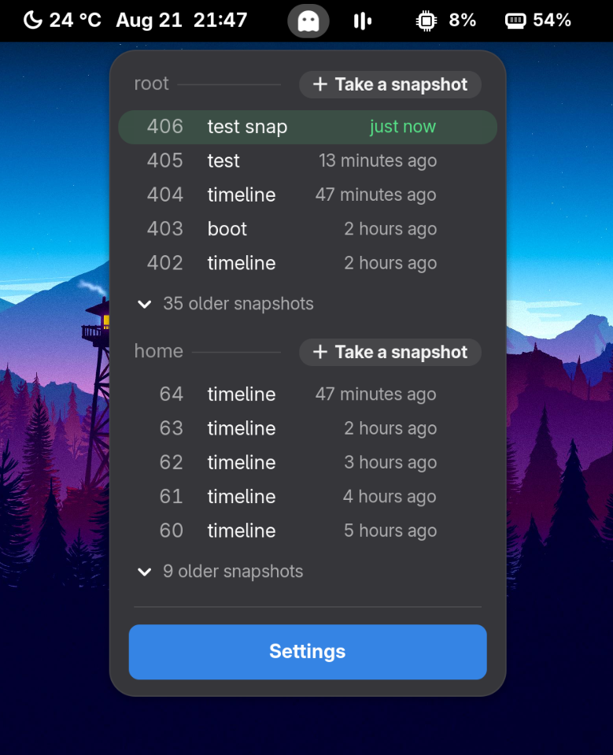
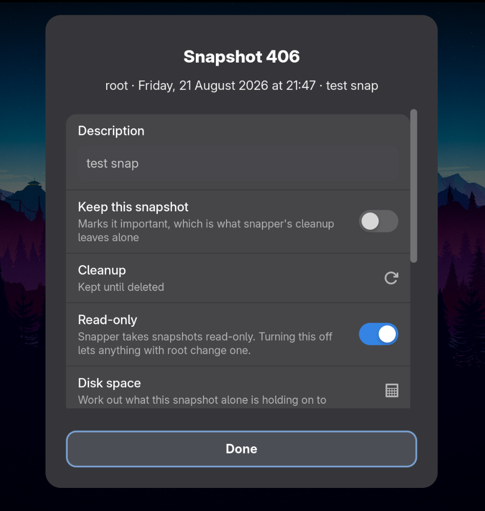
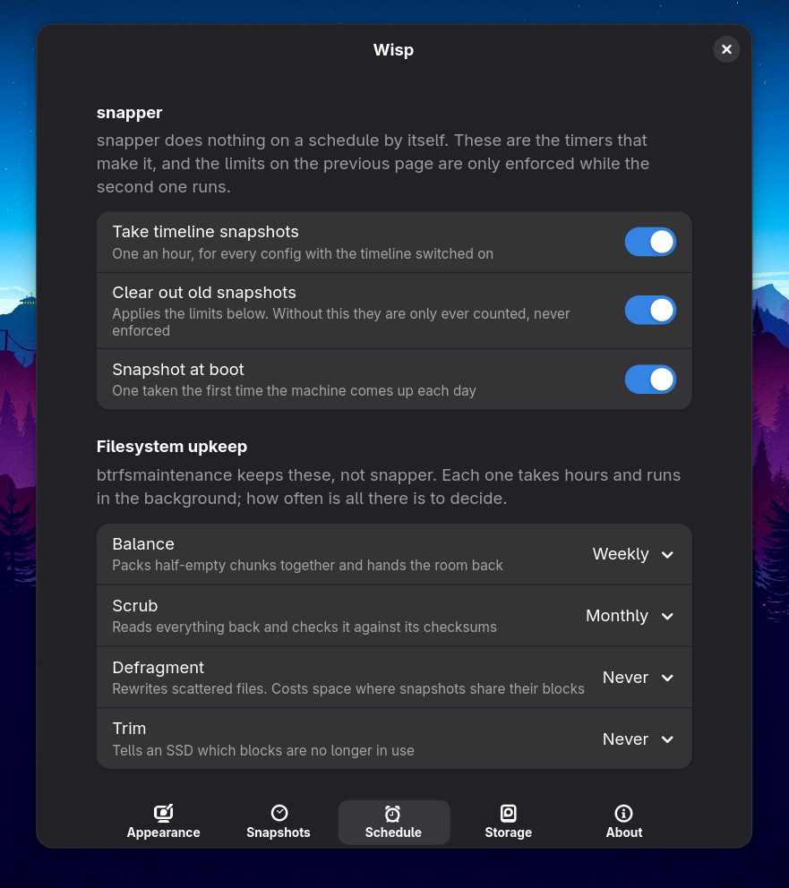
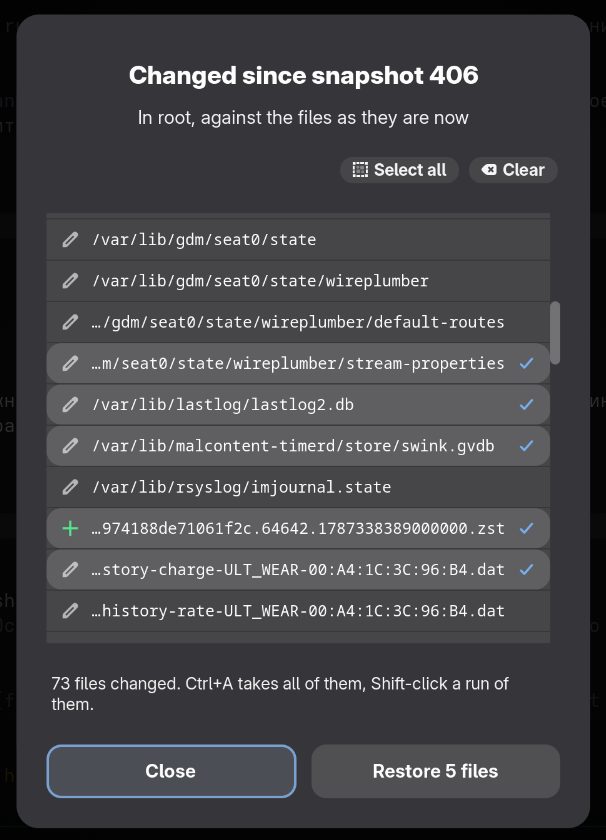

<p align="center">
  <picture>
    <source media="(prefers-color-scheme: dark)" srcset="docs/icon-dark.png">
    
  </picture>
</p>

<h1 align="center">Wisp</h1>

<p align="center">
  Snapper snapshots in the top bar - take, browse, compare, restore, roll back.
</p>

<p align="center">
  
  
  <a href="https://github.com/sponsors/epogonii"></a>
</p>

## What does this extension do?

snapper already takes snapshots on most btrfs installations - one an hour, one
either side of every package transaction - and reading them back means the
command line or a separate application. This puts them in the top bar.

> [!TIP]
> **Simple, minimal and good-looking, and still the whole of snapper.**
> A menu and a settings window quiet enough to forget about; behind them,
> comparing, restoring single files, rolling the machine back, setting a config
> up, and the timers that keep it all going.

The name is the faint light that hangs over a bog at night. A snapshot is the
same sort of thing: the shape the system had, still there after the moment it
belonged to.

## Screenshots

<p align="center">
  
</p>

A snapshot's own window, and the timers snapper acts on:

<p align="center">
  
  
</p>

What changed since a snapshot, with the files to put back picked out of it:

<p align="center">
  
</p>

---

## What has to be installed first

| | |
| --- | --- |
| `snapper` and one config | **Required.** Not installed by default on most distributions, and there is nothing to list until a config exists |
| `polkit` | Anything that belongs to root: a snapshot for a config this account may not change, restoring files, rolling back, and the lock in front of the menu |
| `util-linux`, `btrfs-progs` | The Storage page. Sizes for the snapshots themselves need btrfs counting them, which is off by default - the Storage page turns it on |
| `btrfsmaintenance` | Balance, scrub, defrag and trim on the Schedule page. snapper does not need it |

GNOME Shell 46 or newer, Wayland or X11. polkit and util-linux are on
practically every desktop install already; snapper usually is not.

```sh
sudo dnf install snapper       # Fedora, RHEL, CentOS
sudo apt install snapper       # Debian, Ubuntu
sudo pacman -S snapper         # Arch
sudo zypper install snapper    # openSUSE, where it is there from the start
```

Then one config for whatever should be snapshotted:

```sh
sudo snapper -c root create-config /
```

None of that has to be typed. When snapper is missing the menu says so and
hands over the install command for the distribution it is running on, a config
can be set up from the settings window, and the timers are switches on the
Schedule page.

---

## Features

- Each config's snapshots, newest first, with the pair around a package
  transaction shown as the one event it was
- Take one with a description that no cleanup rule will remove; delete one after
  a confirmation that says what goes; open one in Files and read it as it was
- Rename it, mark it important, change its cleanup rule, turn read-only off, and
  add up what it alone is holding on to
- Everything that has changed since a snapshot, searchable, and for a package
  transaction exactly what the transaction changed
- Put chosen files back, or roll the root filesystem back - with a word first
  when `/etc/fstab` is going to overrule it
- Timeline limits per config, a new config or the removal of one, snapper's
  timers, btrfsmaintenance's jobs, and what btrfs has handed out to chunks
- Reads a config without asking for a password, by offering to add the account
  to it once; an optional polkit lock in front of the menu if you want one
- Live, whoever changed the snapshots; whatever is missing gets named with the
  line that installs it; follows the light and dark theme

---

## How to install

Not on extensions.gnome.org yet. From a release:

```sh
gnome-extensions install --force wisp.zip
gnome-extensions enable wisp@epogonii.github.io
```

From the sources, `tools/install-local.sh` installs into the running session and
`tools/pack.sh` builds the same zip. Log out and back in first (X11: `Alt+F2`,
then `r`): a running shell keeps an extension's JavaScript in memory for the
life of the process. Preferences apply immediately.

---

## Permissions

snapperd does not use polkit. Each config carries its own `ALLOW_USERS` and
`ALLOW_GROUPS` in `/etc/snapper/configs/<name>`, both empty until somebody fills
them in, so a fresh install tells an ordinary account nothing at all.

Rather than ask for a password every time it lists something, Wisp offers to add
the account to the config once, through `pkexec`:

```sh
sudo snapper -c <config> set-config ALLOW_USERS=<you> SYNC_ACL=yes
```

polkit puts up that prompt, and the password never reaches the extension.
`SYNC_ACL` is what puts an ACL on the snapshot directory, without which the
snapshots are listed but their files cannot be opened.

Everything after that goes straight to snapperd over D-Bus as the user.
Restoring files, rolling back, the settings in `/etc/snapper/configs` and the
systemd timers are root's either way: each one asks, and shows the command it is
about to run.

`snapper rollback` points btrfs at a different default subvolume, so it takes
effect at the next boot - and does nothing at all if `/etc/fstab` names the
subvolume it mounts at `/`. Where that is the case Wisp says so instead of
letting the reboot say it.

---

## Preferences

```sh
gnome-extensions prefs wisp@epogonii.github.io
```

| Page | What is on it |
| --- | --- |
| Appearance | Where the indicator sits and whether it is shown, what a middle click does, how many snapshots each config lists, ages or dates, whether a finished action answers with a pill under the panel or a notification, and the lock: never, after a while, or every time |
| Snapshots | One row per config with the subvolume it snapshots, whether it shows in the menu, whether this account may read it, and the timeline and numbered limits snapper cleans up by |
| Schedule | snapper's three timers, and how often btrfsmaintenance balances, scrubs, defragments and trims |
| Storage | What the filesystem is doing: size, what btrfs has handed out to chunks, what is written, what is free, and the same per chunk type. Also what each config's snapshots are taking between them, once btrfs is counting - which it is not by default, so there is a button that turns it on |
| About | The version, the project page, and the links below |

---

## Translations

Every string is translatable, and none is translated yet. `po/wisp.pot` holds
them, and `tools/update-po.sh` rebuilds it from the sources - `tools/files.txt`
is the list it reads, so a new file is translatable as soon as it ships - and
brings each `po/*.po` up to date.

A language starts as a copy of the pot:

```sh
msginit --locale=<code> --input=po/wisp.pot --output=po/<code>.po
```

Fill it in, run `tools/update-po.sh` to check it compiles, and
`tools/install-local.sh` puts it where the shell looks.

---

## Reporting issues

- Extension version, GNOME Shell version, distribution
- `snapper --version`, and whether `systemctl status snapperd.service` answers
- `journalctl --user -b 0 -o cat /usr/bin/gnome-shell | grep -i wisp`
- A screenshot where it makes sense

---

## Support

The extension is free and stays free. If it earned a coffee:

<p align="center">
  <a href="https://github.com/sponsors/epogonii"></a>
  <a href="https://www.paypal.com/paypalme/pogonii"></a>
</p>

| | |
| --- | --- |
| GitHub Sponsors | **[github.com/sponsors/epogonii](https://github.com/sponsors/epogonii)**, monthly or one time |
| PayPal | **[paypal.me/pogonii](https://www.paypal.com/paypalme/pogonii)** |
| Bitcoin | `18KtJEw8gt2oyicszwMUkbAKMHHXS9nwKR` |
| Ethereum | `0x4f2fb6a154526a72d612afa2e3a8129e30ca0996` |
| Cardano | `DdzFFzCqrhsmpnmUqivufj3TmDzksP4HKzcksRUNVr8xA4Gbj7PngV6TfkZuqUqeeKxp138t2Ftd1HypLFkUQ8F1hGtEmyhTP9VnZcUt` |

The same links sit on the About page of the extension's preferences.

---

## License

GPL-2.0-or-later, see [LICENSE](LICENSE).
